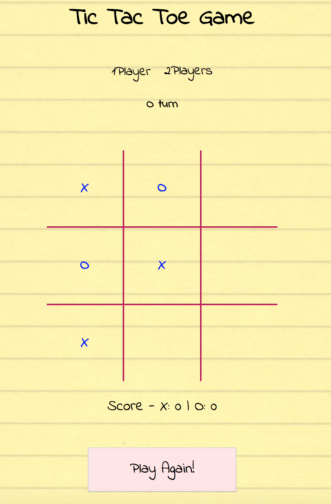

# Project 0
  by Sarabjit Bansal.

## Tic Tac Toe Game


Tic-tac-toe is a one or two player game. Players can choose X or O taking turns marking cells in a 3×3 grid. The player who succeeds in placing three of their marks in a horizontal, vertical or diagonal row wins the game.

This project includes:
HTML
Java script
CSS


**Game has two modes:**

1 Player
2 Players

1Player - In this mode user plays(O) with the computer(X). There is a timer for placing (X) against the users move(O).



2Players - In this mode 2 players can play game choosing either X or O. There is an additional option of choosing the grid size of 3 or 4 in this mode. Grids are created in Javascript.


This project has two .js files - main2.js and game2.js. The game2.js file has all the functionalty and main2.js is the presentation file.

This function creates the N*N size board.

````````javascript```````

const createBoard = function(boardSize) {

  if (boardSize !== "" && typeof(boardSize) !== 'undefined') {
    for (let i = 0; i < boardSize; i++) {
      var row = $('<tr />').appendTo('#tbl');
      for (let j = 0; j < boardSize; j++) {

        let tabId = `B${i}${j}`;
        var cell = $('<td />').attr({id:tabId, class : 'boxes'}).appendTo(row);
      }
    }
  }
}

``````

Future Improvements:


**Improved AI - refer to minimax algorithm
**Work on CSS - try to incorporate more animations and nicer backgrounds, icon selection instead of X,O
**Improved user experience
**Display results as an overlay on the grid with grid opacity lowered
**Line through the winning rows
~~~~~~~~~~~~~~~~~~~~~~~~~~~~~~~~~~~~~~~~~~~~~
